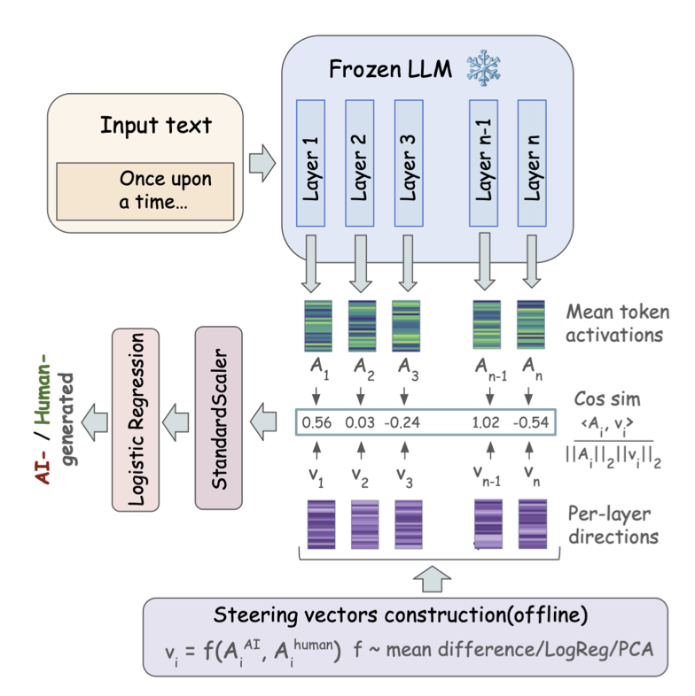

# SV-Detect

[](https://arxiv.org/abs/2606.07313)
[](https://2026.emnlp.org/)

**Accepted at EMNLP 2026 (Main Conference).**

Code for *SV-Detect: AI-generated Text Detection with Steering Vectors*.

**SV-Detect is a method for detecting AI-generated text using the internal
representations of a frozen language model.** Instead of relying only on
surface-level text features, SV-Detect learns steering vectors that
separate human-written and machine-generated text in the model's hidden
representation space. For each input text, it measures how strongly the
model's activations align with these layer-wise directions, and then
uses these projection features to predict whether the text was written
by a human or generated by an AI system.

The method is lightweight because it does not require fine-tuning the
underlying language model. It generalizes across challenging settings,
including different text domains, different source models, and
machine-edited text such as polished or rewritten passages. Overall,
**SV-Detect treats AI-generated text detection as a representation-space
probing problem and shows that steering vectors provide a simple,
interpretable, and effective way to detect machine-generated text.**

<table>
<tr>
<td width="50%" valign="middle">

</td>
<td width="50%" valign="middle">
<em>Overview of SV-Detect. A frozen LLM is used to extract mean-pooled
hidden activations from each layer. Activations are projected onto
layer-wise steering vectors, and the resulting cosine similarity scores
are standardized and passed to a logistic regression classifier for
AI-generated text detection.</em>
</td>
</tr>
</table>

## Layout

```
sv-detect/
├── src/
│   ├── extract/                    # 1) activations → SVs → dot products
│   │   ├── extract_activations.py       # forward pass, mean-pool per layer
│   │   ├── compute_steering_vectors.py  # mean-diff / logreg / PCA construction
│   │   ├── train_logreg.py              # StandardScaler + LogReg detection head
│   │   ├── nb_pipeline.py               # shared library (SV construction,
│   │   │                                # dot products, QR-orthonormalization,
│   │   │                                # detector build/eval)
│   │   ├── compute_dots_bulk.py         # batched dot-product projection for
│   │   │                                # the DetectRL cross-source matrix
│   │   └── all_dots.py                  # one-shot builder for every dot-product
│   │                                    # file used downstream (MD 16-cell,
│   │                                    # MIRAGE 3-vec, MD-4vec, MIRAGE-1vec)
│   ├── classifier/                 # 2) per-benchmark drivers
│   │   ├── analyze_detectrl.py
│   │   └── analyze_mirage.py
│   ├── analysis/                   # 3) cross-benchmark + auxiliary evaluation
│   │   ├── md_matrix.py                 # DetectRL Multi-Domain 16-cell matrix
│   │   ├── all_experiments.py           # one-shot metrics dump across MD /
│   │   │                                # MIRAGE-3vec / reverse transfer /
│   │   │                                # MIRAGE-1vec
│   │   ├── mirage_to_detectrl.py        # MIRAGE → DetectRL transfer, 3 SV
│   │   │                                # construction variants side by side
│   │   ├── padben_eval.py               # PADBen 5-task × 5-setup evaluation
│   │   │                                # of pretrained SV-Detect detectors
│   │   ├── raid_eval.py                 # RAID zero-shot transfer (24 configs)
│   │   ├── raid_matrix.py               # RAID 24 × 24 cross-source matrix
│   │   ├── raid_to_everything.py        # RAID-trained detector → DetectRL /
│   │   │                                # MIRAGE / PADBen (backward direction)
│   │   ├── layer_importance.py          # cross-benchmark layer-importance
│   │   │                                # correlation (MIRAGE vs DetectRL)
│   │   └── roberta_padben.py            # RoBERTa-fair baseline on PADBen
│   ├── baselines/                  # 4) other-method comparisons
│   │   ├── roberta_fair.py              # RoBERTa-base/large fine-tuned on the
│   │   │                                # same MIRAGE pool SV-Detect uses
│   │   └── prep_repreguard_data.py      # convert DetectRL / MIRAGE JSONs into
│   │                                    # RepreGuard's expected input format
│   ├── interpret/                  # 5) interpretability (Section 5)
│   │   ├── interpret_steering_vectors.py       # per-layer attribution + logit-lens
│   │   ├── interpret_steering_ngrams.py
│   │   ├── interpret_steering_vectors_text.py
│   │   ├── regex_detector.py                    # regex/stylistic baseline (generic)
│   │   ├── regex_detector_detectrl.py
│   │   ├── regex_detector_mirage.py
│   │   ├── compare_sae_dense.py
│   │   └── inspect_logreg_weights.py
│   ├── ablation/                   # 6) classifier + construction ablations
│   │   └── compare_classifiers.py
│   ├── visualize_tokens.py         # Figure 1 per-token visualization
│   └── download_data.py            # DetectRL / MIRAGE / COLING downloader
├── data/                           # (Reserved for cached datasets; gitignored)
├── environment.yml                 # Conda environment used in our experiments
├── requirements.txt                # Pip equivalent for non-conda users
└── README.md
```

Analysis scripts read from `SVDETECT_BASE` (env var; default `.`). Set
it to the root that contains `data/activations/`, `data/svs/`,
`data/dots/`, `results/`, etc., or run from that directory.

## Quick start

### 1. Install

```bash
conda env create -f environment.yml
conda activate sv-detect
# or:
pip install -r requirements.txt
```

Required: Python ≥ 3.11, PyTorch 2.10+ with CUDA 12.8, transformers
4.57+, scikit-learn 1.8+.

### 2. Download benchmarks

```bash
python -m src.download_data --benchmark detectrl
python -m src.download_data --benchmark mirage
python -m src.download_data --benchmark coling   # optional
```

DetectRL and MIRAGE are pulled from their official HuggingFace mirrors.
PADBen (arXiv 2511.00416) and RAID (Dugan et al., ACL 2024) are pulled
directly from their release archives; use their upstream download
instructions. You will need a HuggingFace token (`export HF_TOKEN=...`)
to load gated backbones such as `Llama-3.1-8B-Instruct`.

### 3. Extract activations

```bash
python -m src.extract.extract_activations \
    --llm EleutherAI/gpt-neo-2.7B \
    --data-root data/DetectRL \
    --out-dir data/activations/gpt-neo-2.7B/DetectRL \
    --splits real_train fake_train real_val fake_val test
```

Output: per-sample mean-pooled residuals as
`(N, num_layers, hidden_size)` `.npy` chunks. One forward per sample;
splits parallelise trivially. LLaMA-3.1-8B and other backbones use the
same interface — pass `--llm meta-llama/Llama-3.1-8B-Instruct`.

### 4. Compute steering vectors + dot-product features

```bash
python -m src.extract.compute_steering_vectors \
    --activations-dir data/activations/gpt-neo-2.7B/DetectRL \
    --methods mean pca logreg \
    --filters all woweak \
    --out-dir data/svs/gpt-neo-2.7B/DetectRL
```

This produces both the steering vectors `steering_vectors_<method>.npy`
(shape `(L, H)`) and per-sample dot-product features
`<split>_dot_products_<method>.npy` (shape `(N, L)`) for the downstream
classifier.

For the DetectRL Multi-Domain cross-source matrix and derived 4-vector /
1-vector systems, use the batched builders:

```bash
# DetectRL MD: dot every subset test set with every subset SV
python -m src.extract.compute_dots_bulk \
    --acts-dir data/activations/gpt-neo-2.7B/DetectRL_MD \
    --sv-dir   data/svs/gpt-neo-2.7B/DetectRL_MD \
    --out-dir  data/dots/detectrl_md \
    --train-subsets arxiv writing_prompt xsum yelp_review

# Every dot-product family needed by downstream analysis (MD 16-cell,
# MIRAGE-3vec, MD-4vec reverse-transfer, MIRAGE-1vec)
python -m src.extract.all_dots \
    --acts-root data/activations/gpt-neo-2.7B \
    --sv-root   data/svs/gpt-neo-2.7B \
    --out-root  data/dots
```

### 5. Train and evaluate the detector

```bash
# DetectRL (in-domain + Multi-Domain / Multi-LLM / Multi-Attack splits)
python -m src.classifier.analyze_detectrl \
    --svs-dir data/svs/gpt-neo-2.7B/DetectRL \
    --method logreg

# DetectRL Multi-Domain 16-cell cross-source matrix
python -m src.analysis.md_matrix \
    --dots-dir data/dots/detectrl_md \
    --method logreg \
    --out-json results/md_matrix.json

# MIRAGE (3-vector orthonormal system)
python -m src.classifier.analyze_mirage \
    --svs-dir data/svs/gpt-neo-2.7B/MIRAGE \
    --tasks generate polish rewrite

# One-shot summary across MD / MIRAGE-3vec / reverse-transfer / MIRAGE-1vec
python -m src.analysis.all_experiments \
    --experiments md_16cell mirage_3vec reverse_transfer mirage_1vec \
    --out-dir results/all_experiments

# COLING-2025 MGT
python -m src.extract.train_logreg \
    --dots-dir data/svs/gpt-neo-2.7B/COLING_2025_MGT_en \
    --methods mean pca logreg \
    --filters all woweak woTGPT35weak
```

### 6. Cross-benchmark and OOD transfer

Detectors trained on one benchmark, evaluated as-is on another
(no target-benchmark training, no threshold recalibration):

```bash
# MIRAGE → DetectRL (3 SV construction variants: polish-only-500, union-800,
# 3-vec orthonormal)
python -m src.analysis.mirage_to_detectrl \
    --mirage-svs-dir data/svs/gpt-neo-2.7B/MIRAGE \
    --acts-root      data/activations/gpt-neo-2.7B/DetectRL_MD \
    --out-json       results/mirage_to_detectrl.json

# DetectRL / MIRAGE → PADBen (5 tasks × 5 setups per PADBen §5.1)
python -m src.analysis.padben_eval \
    --detector mirage_3vec \
    --padben-root data/PADBen \
    --acts-root   data/activations/gpt-neo-2.7B/PADBen \
    --out-dir     results/padben

# MIRAGE / MD-4vec → RAID (all 24 configs, zero-shot)
python -m src.analysis.raid_eval \
    --detector md_4vec \
    --raid-root data/RAID \
    --acts-root data/activations/gpt-neo-2.7B/RAID \
    --out-dir   results/raid

# In-domain RAID: 24 × 24 cross-source matrix (per-config SVs + classifier)
python -m src.analysis.raid_matrix \
    --acts-root data/activations/gpt-neo-2.7B/RAID \
    --method    logreg \
    --out-json  results/raid_matrix.json

# RAID → DetectRL / MIRAGE / PADBen (backward direction, 6-vector RAID system)
python -m src.analysis.raid_to_everything \
    --raid-acts data/activations/gpt-neo-2.7B/RAID \
    --targets   detectrl mirage padben \
    --out-json  results/raid_to_everything.json
```

### 7. Baselines

```bash
# RoBERTa-fair: fine-tune RoBERTa on the *same* MIRAGE pool SV-Detect uses
# (800 pairs = 500 polish + 150 generate + 150 rewrite, or polish-only 500)
python -m src.baselines.roberta_fair \
    --model roberta-base \
    --mirage-train-dir data/MIRAGE/train \
    --detectrl-root    data/DetectRL \
    --subset all \
    --out-dir results/roberta_fair/roberta-base

# RepreGuard: convert DetectRL and MIRAGE into RepreGuard's input format,
# then run their code (github.com/NLP2CT/RepreGuard) against these JSONs.
# Reproduction requires a small patch to their pipeline —
# see patches/repreguard/README.md.
python -m src.baselines.prep_repreguard_data \
    --mirage-train-dir       data/MIRAGE/train \
    --mirage-root            data/MIRAGE \
    --detectrl-benchmark-dir data/DetectRL \
    --out-dir                data/repreguard_input

# RoBERTa-fair on PADBen (matched-supervision comparison to SV-Detect)
python -m src.analysis.roberta_padben \
    --model-path  results/roberta_fair/roberta-base/model \
    --model-label roberta-base-800p \
    --padben-root data/PADBen \
    --out-dir     results/padben_roberta
```

### 8. Interpretability (Section 5)

```bash
# Per-layer attribution + logit-lens for the top-contributing layers
python -m src.interpret.interpret_steering_vectors \
    --llm EleutherAI/gpt-neo-2.7B \
    --sv-path data/svs/gpt-neo-2.7B/MIRAGE/steering_vectors_logreg_generate.npy \
    --top-k 12 --out-tsv interpret_out/logit_lens_mirage_generate.tsv

# Cross-benchmark layer-importance correlation (MIRAGE vs DetectRL-MD)
python -m src.analysis.layer_importance \
    --mirage-dots-dir  data/dots/mirage_3vec \
    --md-dots-dir      data/dots/reverse_md4vec \
    --method           mean \
    --out-json         results/layer_importance.json

# Regex / stylistic-feature baselines
python -m src.interpret.regex_detector_detectrl --data-root data/DetectRL
python -m src.interpret.regex_detector_mirage   --data-root data/MIRAGE

# Figure 1: per-token AI-vs-human projection visualisation
python -m src.visualize_tokens \
    --sv-path data/svs/gpt-neo-2.7B/MIRAGE/steering_vectors_logreg_generate.npy \
    --raw-json data/MIRAGE/raw_texts/DIG/generate.json \
    --out-dir figures/teaser_pngs
```

### 9. Ablations

```bash
# Downstream classifier (LogReg vs CatBoost vs KNN vs …) on the same
# projection features
python -m src.ablation.compare_classifiers \
    --dots-dir data/svs/gpt-neo-2.7B/DetectRL_MD \
    --method   logreg
```

See the paper for the reference numbers each of these reproduces.

## Hyperparameters

The full set of hyperparameters (backbones, extraction, steering-vector
construction, detection head, per-experiment SV systems, RoBERTa-fair
training, dataset sizes, and evaluation metrics) is documented in
[`configs/hyperparameters.yaml`](configs/hyperparameters.yaml). Headline
settings:

| Component | Setting |
|---|---|
| Frozen backbone (default) | `EleutherAI/gpt-neo-2.7B`, fp16, 32 layers, hidden 2560 |
| Frozen backbone (RepreGuard comparison) | `meta-llama/Llama-3.1-8B-Instruct`, fp16 — matches RepreGuard's own backbone |
| Activation extraction | `max_seq_length=2048`, mean-pool per layer |
| Steering vector (default) | Logistic regression, `C=0.01`, liblinear, ℓ₂, `fit_intercept=False` |
| Steering vector (alternatives) | Mean-difference, PCA (PC1 of paired differences) |
| Detection head | `StandardScaler` → `LogisticRegression(C=1.0, solver=liblinear, penalty=l2, max_iter=100, fit_intercept=False)` |
| RoBERTa-fair baseline | 5 epochs, batch 16, lr 2e-5, `max_length=512`, seed 42 |
| Random seed | 42 (throughout) |
| Evaluation metrics | AUROC, AUPR, F1, Balanced Accuracy, MCC, TPR@FPR ∈ {1%, 5%, 10%} |

Per-benchmark training-pool sizes (MIRAGE 500-polish default vs. 800-pair
augmented; DetectRL Multi-Domain 50-fake-per-cell subsampling; RAID
6544-train per config; PADBen zero-shot with no training) and
multi-vector SV system definitions (MIRAGE-3vec, MD-4vec, RAID-6vec)
are in the same YAML file.

## Citation

```bibtex
@inproceedings{anonymous2026svdetect,
    title     = {{SV}-Detect: {AI}-generated Text Detection with Steering Vectors},
    author    = {Vishnyakov, Mikhail and Gaintseva, Tatiana},
    booktitle = {The 2026 Conference on Empirical Methods in Natural Language Processing},
    year      = {2026},
    url       = {https://openreview.net/forum?id=eVSq1xBtS7}
}
```
